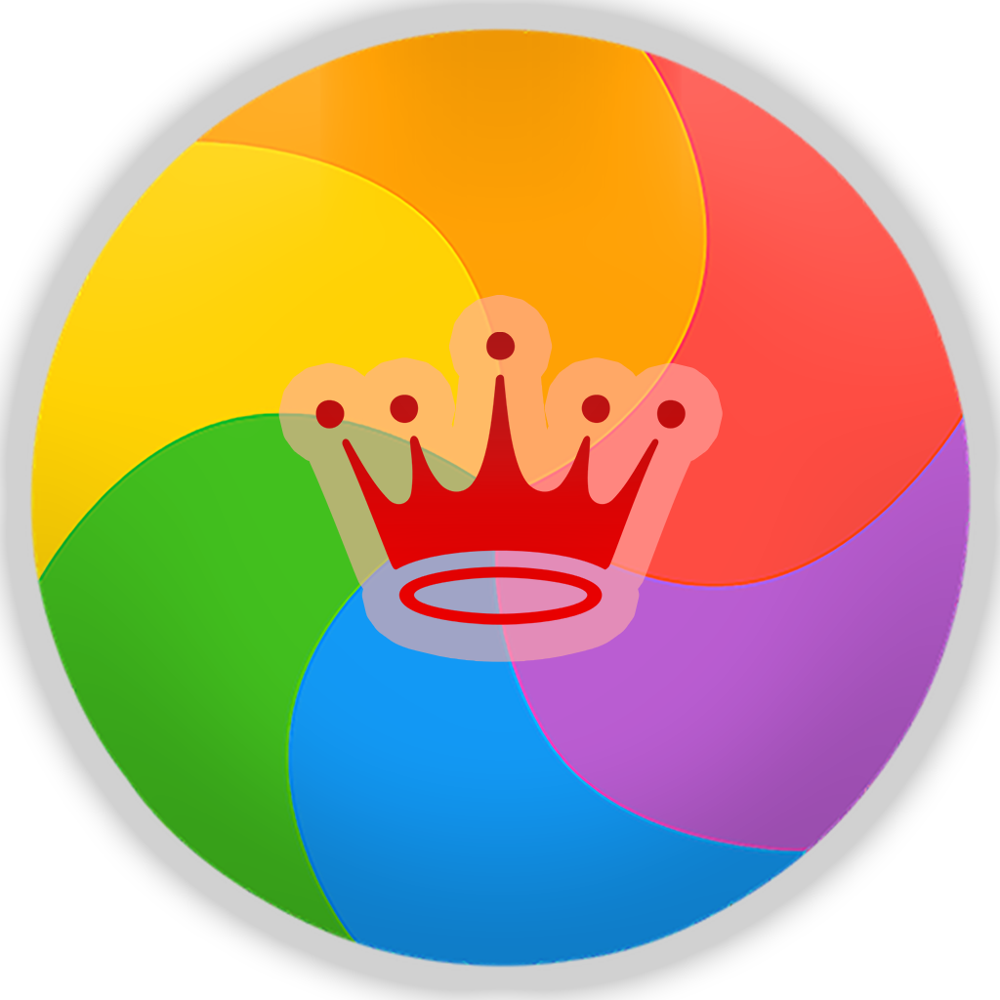

# RGB Master
> A .NET app that runs in the background and synchronises colours to different integratable devices. i.e Razer Chroma devices, Xiaomi Yeelight bulbs.

# About

The project, created by [Dean Kevorkian](https://github.com/deankevorkian) and joined by [Ben Selbiger](https://github.com/benbense), attempts to use official libraries when possible and focuses on the synchronisation between the devices, rather than the way we integrate with the device and its API/SDK. i.e - Razer's `Colore` library for syncing colours via Razer's SDK through .NET bindings, and YeelightAPI for controlling Yeelight bulbs and led strips.
We aspire to bring support to as many vendors (code-named "Providers") as we can from both growing worlds of RGB peripherals and RGB IoT devices, and allow synchronizing them together with colors, sounds, effects we support - and even let users define their own effects (code-named ["Flows"](#flows)).

# Development
Currently only available to Windows 10 but built with expectations for future Mac & Linux ports, this project contains the wrappers for several SDKs (code-named "Providers") and the UI (which is a mix of WPF and UWP in order to achieve WPF's complete access and integration to Windows APIs, along with UWP's latest WinUI used in Windows 10 apps by Microsoft, via Xaml Islands experimental technology).

TODO - Write a simple explanation of the project structure, how to build it, UI / Providers logic seperation.

## Table of Contents

- [Supported integrations](#integrations)
- [Prerequisites](#prerequisites)
- [Installation Instructions](#installation)
- [Supported "Effects"](#effects)
- ["Flows"](#flows)
- [Contribution](#contrib)

## Supported integrations
- [x] Razer Chroma
- [x] Yeelight
- [x] Logitech
- [x] MagicHome
- [ ] Corsair - WIP
- [ ] Asus Aura - WIP
- [x] SteelSeries
- [ ] ShellyRGB - WIP
- [x] Phillips Hue
- [ ] Gigabyte RGB FUSION
- [x] NZXT (Hue Plus & Kraken X)

## Prerequisites 

In order to use any of the available providers, make sure you've done the required early steps, as follows -

**Razer**
- Make sure that Razer Synapse with the **Studio** component is installed.

**Yeelight**
- Make sure that LAN Control is enabled by setting it in the Xiaomi Yeelight app.

**Logitech**
- Make sure Logitech G Hub is installed.

**MagicHome**
- Make sure the led strips are configured in the Android or iOS MagicHome app and are detected.

**SteelSeries**
- Make sure you have SteelSeries Engine 3 installed.

## Installation Instructions

1. Download the latest [release](https://github.com/rgb-master-team/RGBMaster/releases).
2. Extract the files to a folder.
3. Run `SignAndInstallApp.bat` as **Administrator** (This script will install the application and it's certification).
4. Launch the **RGBMasterWap** application.

## Supported "Effects"
RGBMaster allows choosing a desired effect for the way colors are chosen.
- Music effect - Sync devices with a color that represents the tone of the current playback music in the running host.
- Dominant effect - Sync devices with the dominant color of the displayed frames in the screen. Might be useful for movies, gaming, etc.
- Cursor effect - Sync devices with the color the cursor's pointing at in every moment :)
- Static color effect - Sync devices with a static color chosen by you. Allows brightness modification to devices as well.
- Gradient color effect - Sync the color of your lights based on a configured gradient pattern. Syncs color switches smoothly between all colors of the pattern.

## "Flows"
RGBMaster should allow choosing a flow, which is our codename for **custom pre-defined effects** created by anyone who wants to.
These effects ought to be exportable and importable to ensure community sharing around this project in order to help it evolve and reach its potential :)

## Contribution
Feel free to suggest any idea you have for this app, or even make one yourself and open a PR. I'll review it and continue maintaining this small app :)

## TODOs
- General
  - [x] Design a simple but nice looking UI
  - [x] Allow selection of the discovered devices in the area
  - [x] Change synchronisation model to the bulbs to an async (currently Razer's `Colore` library asynchronously sets the colour, but we set the bulbs colours with messages sent through sockets synchronously)
  - [ ] Allow general behavior of devices when changing colors - "immediate" or "gradual" for that matter (or let each device device decide for it's own) - It's a bit epileptic as of now.
- Dominant/Cursor effects
  - [x] Add calculation of RGB values for the dominant or average sound in the host system
- Static color effect
  - [x] Introduce a normal color palette that allows simply syncing colours between the devices (regardless of sound in the background)
- Music Mode -
  - [ ] Add configuration settings for effects (transition of the music effect - smooth or sudden, etc.)
  - [ ] Add options such as frequency/time between color changes
  - [x] Allow defining the color spectrum for each volume level
  - [x] Allow defining the spectrum levels themselves (volume levels that trigger changes)
- Misc
  - [ ] Add some basic explanation
  - [x] Add references to libraries used for this to work

## Credits
This project was heavily inspired and utilizes the amazing work of several open-source projects and libraries -

- [diyHue](https://github.com/diyhue/diyHue)
- [YeelightAPI](https://github.com/roddone/YeelightAPI)
- [Colore](https://github.com/chroma-sdk/Colore)
- [ColorThief](https://github.com/KSemenenko/ColorThief)
- [NAudio](https://github.com/naudio/NAudio)
- [RGB.NET](https://github.com/DarthAffe/RGB.NET)
- [OpenRGB.NET](https://github.com/diogotr7/OpenRGB.NET)
- [MagicHomeAPI](https://github.com/nathanielxd/magic-home)
